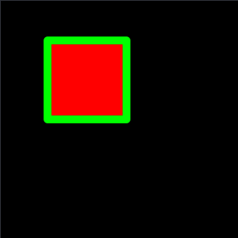
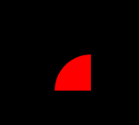

# Core Graphics 图形绘制

> Core Graphics 是 iOS  开发图形框架 Quartz Core 框架的一部分 。功能强大  在自定义控件，简单的图像处理方面有不小的作用

## UIBezierPath

在UIKit 框架中封装了一个类用于绘制图形 UIBezierPath 包含了所有常用的绘制

### 简单图形绘制

#### 基本图形

````swift
UIGraphicsBeginImageContextWithOptions(CGSize(width: 300,height: 300), true, 1)
let ctx = UIGraphicsGetCurrentContext()
let path = UIBezierPath(rect: CGRect(x: 59, y: 50, width: 100, height: 100)) 
UIColor.redColor().setFill()
UIColor.greenColor().setStroke()
path.lineWidth = 10
path.lineCapStyle = .Round
path.lineJoinStyle = .Round
path.fill()
path.stroke()
let image = UIGraphicsGetImageFromCurrentImageContext()
UIGraphicsEndImageContext()
````



1. 首先创建了一个图片上下文300x300 上下文不透明 最后一个scale 图片放大倍数（一般显示图片时应当设置等于retina屏幕的scale）接着获取当前上下文
2. 创建矩形路径
3. 设置填充色，线条色 线条两端的风格 以及线条链接点的风格
4. 填充 绘制
5. 导出图像

#### 图形布尔运算

- 并集

  ```swift
  let path = UIBezierPath()
  let rect = UIBezierPath(rect: CGRect(x: 0, y: 0, width: 50, height: 50))
  UIColor.redColor().setFill()
  let circle = UIBezierPath(ovalInRect: CGRect(x: 30, y: 30, width: 30, height: 30))
  path.appendPath(circle)
  path.appendPath(rect)
  ```

  创建矩形 圆形 两个路径 然后直接加到同一个path中

   

  ​


- 交集

  ````swift
  let path = UIBezierPath()
  let rect = UIBezierPath(rect: CGRect(x: 0, y: 0, width: 50, height: 50))
  rect.addClip()
  UIColor.redColor().setFill()
  let circle = UIBezierPath(ovalInRect: CGRect(x: 30, y: 30, width: 30, height: 30))
  circle.addClip()
  path.appendPath(circle)
  path.appendPath(rect)
  ````

  创建矩形 圆形 两个路径 然后进行剪裁 然后加到同一个path中，实现交集的最重要的就是`addClip()`  目的是剪裁自己的路径以外的的其他元素。

   

- 补集 

  ````swift
  let path = UIBezierPath() 

  let rect = UIBezierPath(rect: CGRect(x: 0, y: 0, width: 100, height: 100))

  rect.addClip()
  UIColor.redColor().setFill()
  let circle = UIBezierPath(ovalInRect: CGRect(x: 60, y: 60, width: 80, height: 80))
  let r = circle.bezierPathByReversingPath()
  path.appendPath(r)
  path.appendPath(rect)
  path.fill()
  ````

  实现的是矩形 - 圆形 实现差集的重点是 `bezierPathByReversingPath()`目的是当图形的路径有交集时相交的部分会被截去

   

## CGContext 图形绘制上下文

记录了绘制图片的尺寸，像素格式等信息

````swift
let width = CGBitmapContextGetWidth(context) //图片宽度
let height = CGBitmapContextGetHeight(context) //图片高度

let bitmapInfo = CGBitmapContextGetBitmapInfo(context) 
let alphaInfo =  CGBitmapContextGetAlphaInfo(context) // 像素ALpha 的一些信息 eg RGB ARGB RGBA 一般是 RGBA
let c = CGBitmapContextGetBitsPerPixel(context) //像素字节数
````

